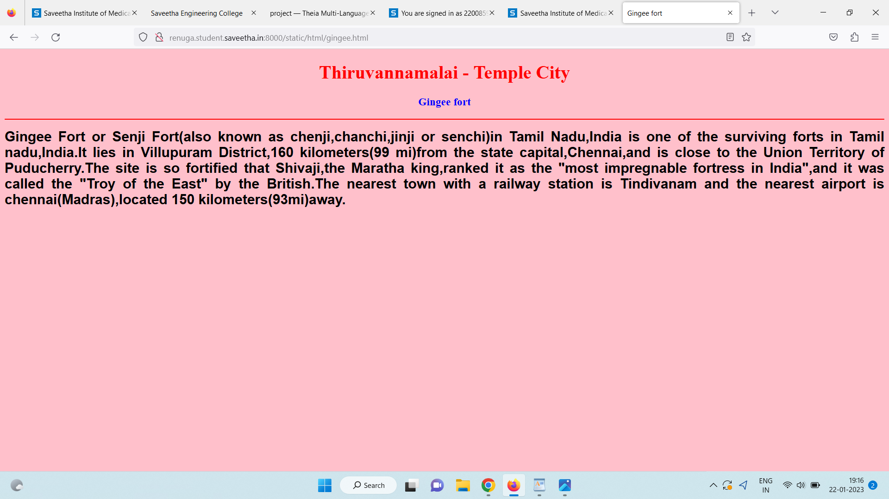

# Places Around Me
## AIM:
To develop a website to display details about the places around my house.

## Design Steps:

### Step 1:
Clone the github respository into Theia IDE.

### Step 2:
Create a new Django project

### Step 3:
Write the needed HTML code.

### Step 4:
Run the Django server and execute the HTML files.

## Code:
```
map.html
<!DOCTYPE html>
<html lang="en">
<head>
<title>My City</title>
</head>
<body>
<h1 align="center">
<font color="red"><b>Thiruvannamalai - Temple City</b></font>
</h1>
<h3 align="center">
<font color="blue"><b>Renuga.S (22008594)</b></font>
</h3>
<center>

<map name="MyCity">
<area shape="circle" coords="190,50,20" href="/static/html/gingee.html" title="Gingee fort">
<area shape="rectangle" coords="230,30,260,60" href="/static/html/virupaksha.html" title=" virupaksha cave">
<area shape="circle" coords="400,350,50" href="/static/html/dam.html" title="sathanoor dam">
<area shape="circle" coords="400,200,75" href="/static/html/bus.html" title=" Bus Stand">
<area shape="rectangle" coords="490,150,870,320" href="/static/html/hill.html" title="Arunachala hill">
</map>
</center>
</body>
</html>

bus.html
<!DOCTYPE html>
<html lang="en">
<head>
<title>Bus Stand</title>
</head>
<body bgcolor="cyan">
<h1 align="center">
<font color="red"><b>Thiruvannamalai - Temple City</b></font>
</h1>
<h3 align="center">
<font color="blue"><b> Bus Stand</b></font>
</h3>
<hr size="3" color="red">
<p align="justify">
<font face="Courier New" size="5">
<b>
Tiruvannnamalai Central Bus Station,commonly known as Tiruvannamalai New Bus Stand,is oneof the bus termini of Tiruvannamalai.
Sister stations include Manalurpet road station and nice other arterial festive time bus stations,which are primarily used for
intra-city buses.The bus station is located 0.5 kilometers(0.31 ml)away from Tiruvannamalai railway station.The shri 
Tiruvannamalai Arunachaleswarar-Abithagujalaambal shrine is 2 km(1.2 ml)away.

</b>
</font>
</p>
</body>
</html>

hill.html
<!DOCTYPE html>
<html lang="en">
<head>
<title>Arunachala hill</title>
</head>
<body bgcolor="yellow">
<h1 align="center">
<font color="red"><b>Thiruvannamalai - Temple City</b></font>
</h1>
<h3 align="center">
<font color="blue"><b>Arunachala hill</b></font>
</h3>
<hr size="3" color="red">
<p align="justify">
<font face="Tahoma" size="5">
Each of the spiritual centers of india has its oown character and line of tradition.Among them all it is Tiruvannamalai
(Arunachala) represents the most direct,the most formless and the least rituelistic of paths,the path of self-
enquiry,whose gateway is silent initiation.This is expressed in the old Tamil saying:"To see Chidambaram,to be born at
Tiruvarur,to die at Banaras or even to think of Arunachala is to be assured of Liberation.""Even to think of" because
in the case of the path physical contact is not necessary.Hence,it was no accident that the Maharshi made 
Tiruvannamalai and its sacred Arunachala Mountain his home.The Maharshi called Arunachala the spiritual Heart of the world.
</font>
</p>
</body>
</html>

gingee.html
<!DOCTYPE html>
<html lang="en">
<head>
<title>Gingee fort</title>
</head>
<body bgcolor="pink">
<h1 align="center">
<font color="red"><b>Thiruvannamalai - Temple City</b></font>
</h1>
<h3 align="center">
<font color="blue"><b>Gingee fort</b></font>
</h3>
<hr size="3" color="red">
<p align="justify">
<font face="Arial" size="5">
<b>
Gingee Fort or Senji Fort(also known as chenji,chanchi,jinji or senchi)in Tamil Nadu,India is one of the surviving forts in
Tamil nadu,India.It lies in Villupuram District,160 kilometers(99 mi)from the state capital,Chennai,and is close to the Union
Territory of Puducherry.The site is so fortified that Shivaji,the Maratha king,ranked it as the "most impregnable fortress in
India",and it was called the "Troy of the East" by the British.The nearest town with a railway station is Tindivanam and the 
nearest airport is chennai(Madras),located 150 kilometers(93mi)away.
</b>
</font>
</p>
</body>
</html>

dam.html
<!DOCTYPE html>
<html lang="en">
<head>
<title>Sathanur dam</title>
</head>
<body bgcolor="lime">
<h1 align="center">
<font color="red"><b>Thiruvannamalai - Temple City</b></font>
</h1>
<h3 align="center">
<font color="blue"><b>sathanur dam</b></font>
</h3>
<hr size="3" color="red">
<p align="justify">
<font face="Georgia" size="5">
Sathanur Dam is formed by Sathanur Reservior,one of the major dams in Tamil nadu.It is constructed across the Thenpennai River 
also called as Pennaiyar River in Thandarampet taluk among Chennakesava Hills.The dam can be reached by road 30km (19mi) from
Tiruvannamalai city.It was constructed in 1958.There is also a large crocodile farm and a fish grotto.Parks are maintained 
inside the dam for tourists to visit and the gardens have been used by the film industry.
</font>
</p>
</body>
</html>

virupaksha.html
<!DOCTYPE html>
<html lang="en">
<head>
<title>virupaksha cave</title>
</head>
<body bgcolor="orange">
<h1 align="center">
<font color="red"><b>Thiruvannamalai - Temple City</b></font>
</h1>
<h3 align="center">
<font color="blue"><b>virupaksha cave</b></font>
</h3>
<hr size="3" color="red">
<p align="justify">
<font face="Georgia" size="5">
Virupaksha cave is one of the ancient caves in India with its history dating back to the 13th century.The cave is located on the 
eastern slopes of the Arunachala Hill.The history of the cave dates back to the time when it was the abode of sage Virupaksha 
Deva.It later gained importance after Sri Ramana Maharshi stayed in the cave for 16 years.The cave derives its name from
Virupaksha Deva,who was a renowned 13th century saint.It is believed that siant Viruapaksha spent most of his life in this
cave and its surroundings.It is also that his body turned into ashes just after his Samadhi(a state of complete oneness).The
holy ash is supposed to be preserved here on the altar.
</font>
</p>
</body>
</html>
```

## Output:





## HTML Validator
.png)

## Result:
The program for implementing image map is executed successfully